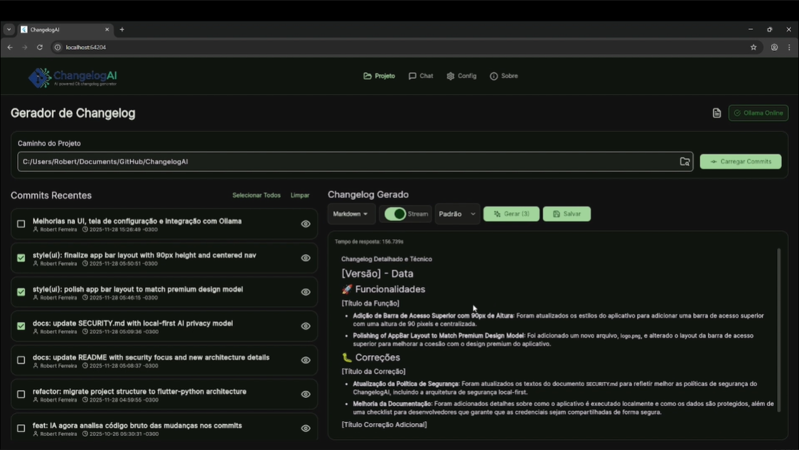
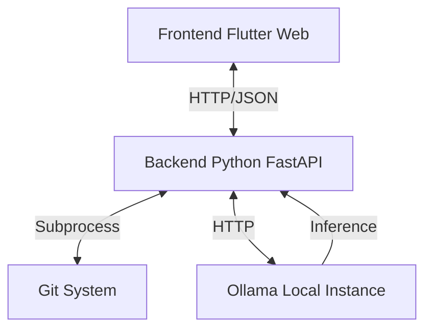

# 📝 ChangelogAI (Showcase)

> **Gerador de Changelog Inteligente & Seguro** - Gere changelogs técnicos e detalhados usando IA localmente, garantindo total privacidade do seu código.

---

## 📋 Índice

- [🎯 Sobre o Projeto](#-sobre-o-projeto)
- [🚀 Motivação](#-motivação)
- [� Segurança & Privacidade](#-segurança--privacidade)
- [🏗️ Como Funciona a Arquitetura](#️-como-funciona-a-arquitetura)
- [�💻 Tecnologias Utilizadas](#-tecnologias-utilizadas)
- [✅ Funcionalidades](#-funcionalidades)
- [👋 Interesse / Contato](#-interesse--contato)

---

## 🎯 Sobre o Projeto

O **ChangelogAI** é uma aplicação desktop/web híbrida que revoluciona a forma como desenvolvedores documentam seus projetos. Utilizando o poder de LLMs (Large Language Models) rodando localmente via **Ollama**, ele analisa o histórico do Git e as alterações de código (diffs) para criar changelogs profissionais, técnicos e bem formatados.

Este repositório serve como uma **Vitrine Técnica** para demonstrar as capacidades e a engenharia por trás do software ChangelogAI.

### 🎯 Objetivos Principais

- **Automação Inteligente**: Transformar mensagens de commit crípticas em documentação legível.
- **Privacidade Absoluta**: Garantir que **nenhuma linha de código** saia da máquina do desenvolvedor.
- **Análise Profunda**: Ler não apenas a mensagem, mas o *código* que mudou (Diff) para descrever a alteração real.
- **Flexibilidade**: Permitir múltiplos formatos de saída (Markdown, JSON, Texto).

---

## 🚀 Motivação

### 🌱 O Desafio

Desenvolvedores perdem horas valiosas escrevendo documentação ou revisando commits antigos para entender o que mudou. Além disso, ferramentas de IA na nuvem representam um risco de vazamento de propriedade intelectual.

### 💡 Nossa Missão

**Automatizar de forma segura a criação do log de atualização, evitando o trabalho massante e repetitivo.**

Queremos que você foque no código, enquanto o ChangelogAI cuida da documentação, garantindo que:
1.  Seu código nunca saia da sua máquina.
2.  A documentação seja gerada instantaneamente.
3.  O resultado seja técnico e preciso, analisando o diff real.

### 📈 Impacto Esperado

- **Redução de 90%** no tempo gasto com documentação.
- **Padronização Profissional** dos changelogs.
- **Eliminação de Riscos** de vazamento de código sensível.
- **Histórico Rico** e fácil de auditar.

---

## 🔒 Segurança & Privacidade

A segurança é o pilar central do ChangelogAI. Diferente de extensões de IDE ou serviços SaaS que enviam seu código para a nuvem, o ChangelogAI foi desenhado para ser **Air-Gapped** (funciona sem internet, desde que o Ollama esteja instalado).

### 🛡️ Por que é seguro?

1.  **Execução Local (Localhost)**:
    *   O Backend Python roda em `127.0.0.1`.
    *   O Ollama roda em `127.0.0.1`.
    *   O Frontend roda no navegador local.
    *   **Nenhum dado trafega pela internet pública.**

2.  **Controle Total**:
    *   Você escolhe qual modelo usar.
    *   Você vê o prompt exato antes de gerar (Logs).

---

## 🏗️ Como Funciona a Arquitetura

O projeto utiliza uma arquitetura híbrida robusta para combinar a performance de operações de sistema com uma interface moderna e reativa.

### O Fluxo de Dados

1.  **Frontend (Flutter)**: O usuário interage com a interface, seleciona o repositório e configura os parâmetros de geração.
2.  **API Gateway (FastAPI)**: Recebe as solicitações do frontend e orquestra as operações.
3.  **Git Engine (Python)**: O backend executa comandos git nativos para extrair diffs e logs de forma eficiente.
4.  **AI Engine (Ollama)**: O diff processado é enviado para o modelo de IA local (Llama 3, Mistral, etc.), que gera o texto descritivo.
5.  **Retorno**: O changelog gerado é enviado de volta ao frontend via streaming para visualização em tempo real.

---

## 💻 Tecnologias Utilizadas

### 🏗️ Frontend (Flutter Web)
- **Flutter 3.x** - Framework UI multiplataforma
- **Provider** - Gerenciamento de estado
- **Http** - Comunicação com backend
- **Flutter Markdown** - Renderização rica de texto

### 🐍 Backend (Python Bridge)
- **Python 3.13** - Linguagem de script
- **FastAPI** - API Gateway local de alta performance
- **Uvicorn** - Servidor ASGI
- **Subprocess** - Execução de comandos Git nativos
- **Psutil** - Monitoramento de recursos do sistema

### 🤖 Inteligência Artificial
- **Ollama** - Runtime local para LLMs
- **Modelos Suportados**: Llama 3, Mistral, CodeLlama, etc.

---

## ✅ Funcionalidades

### 🔍 Análise de Git
- ✅ **Leitura de Log**: Carrega o histórico de commits do repositório selecionado.
- ✅ **Visualização de Diff**: Mostra exatamente o que mudou em cada arquivo.
- ✅ **Seleção Inteligente**: Escolha quais commits incluir no changelog.
- ✅ **Smart Chunking**: Processa automaticamente grandes históricos de commits em lotes para evitar limites de contexto.

### 📝 Geração de Conteúdo
- ✅ **Prompt Enriquecido**: Envia diffs + metadados para a IA.
- ✅ **Streaming**: Resposta em tempo real (efeito digitação).
- ✅ **Templates Personalizáveis**: Crie e gerencie seus próprios prompts para diferentes tipos de changelog.
- ✅ **Múltiplos Formatos**: Markdown, JSON, Texto Puro.

### 🛠️ Ferramentas & Performance
- ✅ **Monitoramento de Sistema**: Acompanhe uso de CPU, RAM e GPU em tempo real.
- ✅ **Controle do Ollama**: Reinicie o serviço e alterne entre GPU/CPU diretamente pelo app.
- ✅ **Otimização de Dados**: Payloads JSON minificados para máxima performance.

---

## � Interesse / Contato

O **ChangelogAI** é um software proprietário atualmente em fase de **Beta Fechado**.

Se você tem interesse em utilizar essa ferramenta na sua empresa ou projeto para garantir documentação de alta qualidade com privacidade total, entre em contato para saber mais sobre disponibilidade e licenciamento.

[� LinkedIn](SEU_LINK_LINKEDIN) | [📧 Email](mailto:SEU_EMAIL)

---

*⭐ Desenvolvido com foco em privacidade e produtividade.*
